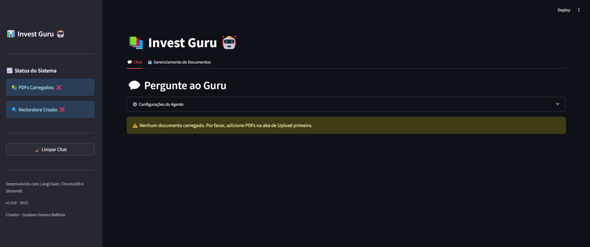
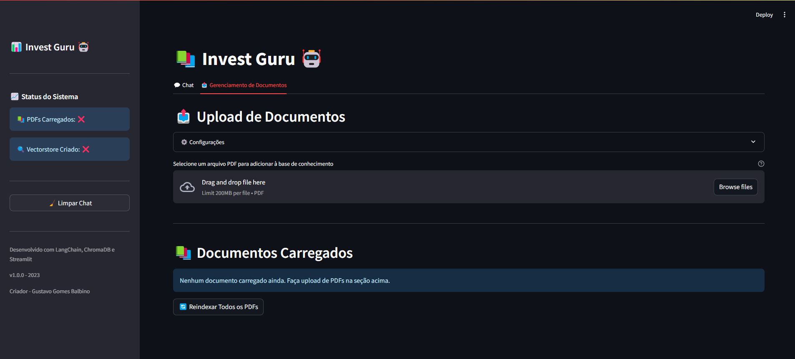
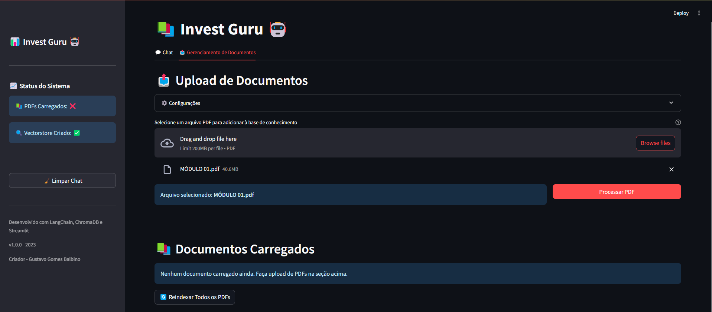
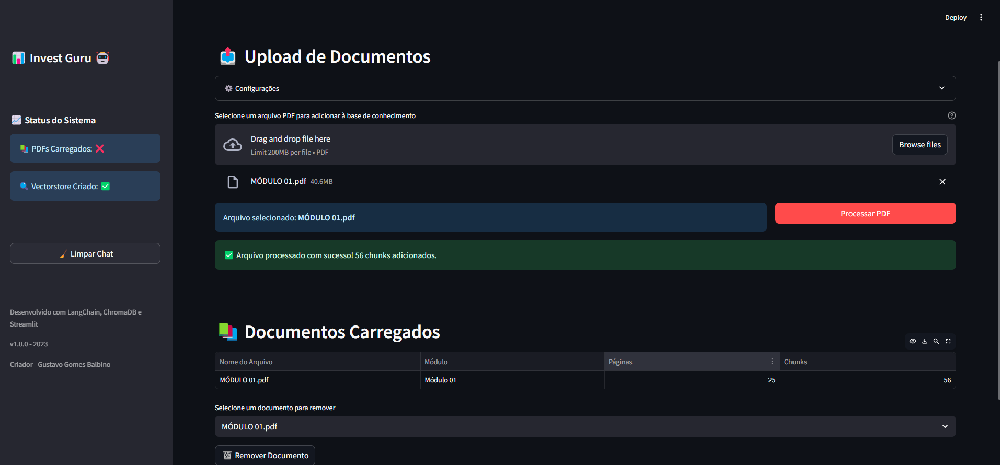
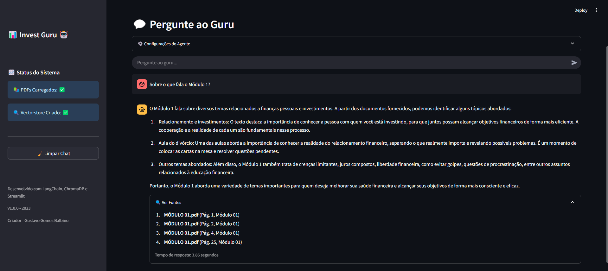

# 📊 Invest Guru - RAG System for Investment Study and Analysis

A Retrieval-Augmented Generation (RAG) system designed to help investors understand financial content and investment-related documents.

This project allows you to upload PDFs such as investor relations reports (RIs), study materials, and financial presentations. A language model (LLM) then answers your questions based solely on the content from these documents — with no speculation or investment recommendations.

---

## 🎯 Purpose

This system is built to:

- 📚 Support learning about finance and investing using real, trusted documents
- 💬 Provide clear and accurate answers like a specialized tutor
- 🔍 Reference the actual content of PDFs as the source for every answer
- 🚫 **Never offer investment suggestions or generate made-up responses**

## ✅ How to Use

### 1️⃣ Access the System

When opening the app, you will see the initial dashboard with the **Chat** tab and status indicators for documents and vector index.

---

### 2️⃣ Upload PDFs

Go to the **Document Management** tab and select a PDF file to add to the knowledge base.

---

### 3️⃣ Process PDFs (Embedding)

After selecting the file, click **Process PDF** to extract the content, generate embeddings, and store it in the vectorstore (ChromaDB).

---

### 4️⃣ Confirm Indexing

The system will confirm successful processing and show how many chunks were added.

---

### 5️⃣ Ask the Guru (LLM Chat)

Return to the **Chat** tab and interact with the assistant. Responses are always based on the uploaded documents, with source references displayed.

---

## ⚠️ Disclaimer

This is an educational tool only. It does **not** perform financial analysis or provide investment advice.
